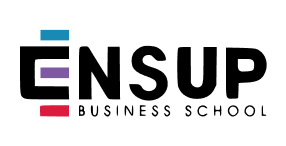

# ENSUP : Git et GitHub

Journée du 17 septembre 2026 · Bachelor · Hamza Abid

Ce dépôt reçoit les travaux pratiques de la journée des associations.

1. Créez un fork dans votre compte, puis clonez votre fork.
2. Travaillez uniquement dans `rendus/VOTRE_IDENTIFIANT/`.
3. Suivez le livret : commits, branches, revue, conflit et livraison.
4. Ouvrez une pull request de votre `main` vers le `main` de ce dépôt après le TP 3.
5. Gardez cette PR ouverte et continuez à pousser : les nouveaux commits y apparaissent.

[Livret guidé](supports/LIVRET-ETUDIANT.md) · [Mémo](supports/MEMO-GIT.md) · [QCM individuel](https://abid-hamza.com/ensup-git/qcm/)

Chaque étudiant conserve son historique. Les PR de travail se font dans votre fork ; la PR de collecte se fait ici. Le formateur intègre les rendus avec un commit de fusion pour préserver les commits des élèves.

Utilisez des personnes fictives dans le projet et votre identifiant pour votre dossier. Aucun mot de passe, token ou coordonnée personnelle dans les rendus. Ne modifiez pas les fichiers communs ni les dossiers des autres.
